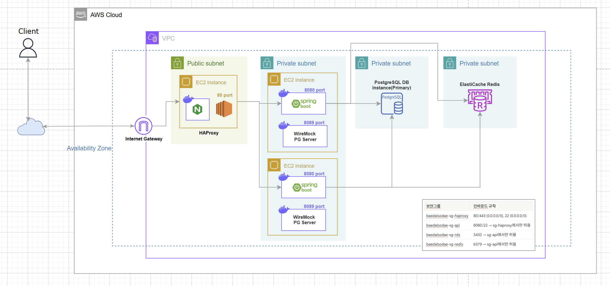
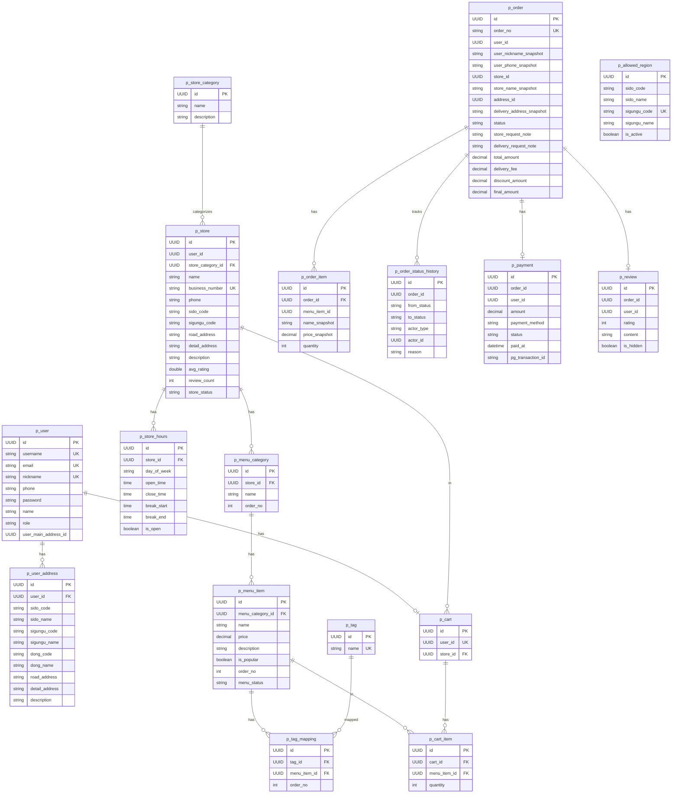

# 🛵 BaedalSodae — 음성 메뉴 추천 배달 플랫폼

> **음성 가게 추천**을 지원하는 배달 서비스 플랫폼입니다.
> 전국 지역을 대상으로 하며, 현재는 **광화문 내 지역**에서만 서비스를 지원합니다.
> Spring Boot 백엔드 프로젝트입니다.

---

## 📑 목차

- [팀원 역할분담](#-팀원-역할분담)
- [서비스 구성 및 실행 방법](#-실행-방법)
- [프로젝트 목적](#-프로젝트-목적)
- [ERD](#-erd)
- [기술 스택](#-기술-스택)
- [아키텍처](#-아키텍처)
- [주요 기능](#-주요-기능)
- [API 엔드포인트](#-api-엔드포인트)
- [테스트](#-테스트)
- [기술 스택 선정 배경](#-기술-스택-선정-배경)

---

## 👥 팀원 역할분담

| 팀원      | 담당 도메인                       |
|---------|------------------------------|
| **신혜원** | 가게, 가게 카테고리, 지도 API 도입       |
| **이현빈** | 로그인 및 JWT 인증, 회원, 회원 지역, 관리자 |
| **정재빈** | 주문, 장바구니, 서버 구축 및 배포         |
| **하지혜** | 메뉴, 태그, 가게 운영시간, 운영 허용 지역    |
| **한병두** | 결제, 리뷰, 음성 추천 AI             |

---

## 🚀 실행 방법

### 방법 1: Docker Compose (권장)

#### 1. 사전 요구사항

```bash
docker --version          # Docker 24+ 권장
docker compose version    # Docker Compose v2+
```

#### 2. 환경 변수 설정

```bash
cp .env.example .env
# .env 파일을 열어 필요한 값을 설정하세요
```

**.env 주요 항목:**

```env
# PostgreSQL
POSTGRES_DB=baedalsodae
POSTGRES_USER=baedal_user
POSTGRES_PASSWORD=your_password

# Redis
SPRING_DATA_REDIS_PASSWORD=your_redis_password

# JWT
JWT_SECRET=your_jwt_secret_key_at_least_32_chars
JWT_EXPIRATION=3600000
JWT_REFRESH_EXPIRATION=604800000
```

#### 3. 빌드 및 실행

```bash
# 전체 서비스 빌드 후 실행
docker compose up --build

# 백그라운드 실행
docker compose up -d

# 로그 확인
docker compose logs -f backend
docker compose logs -f db
docker compose logs -f redis
```

#### 4. 접속 URL

| 서비스        | URL                          |
|------------|------------------------------|
| 백엔드 API    | http://localhost:8080/api/v1 |
| PostgreSQL | localhost:5432               |
| Redis      | localhost:6379               |

#### 5. 서비스 종료

```bash
# 중지
docker compose down

# 중지 + 볼륨 삭제 (DB 초기화)
docker compose down -v
```

---

### 방법 2: 로컬 직접 실행

#### 사전 요구사항

- Java 17+
- PostgreSQL 16
- Redis 7

#### 실행

```bash
# 1. 환경 변수 설정
cp .env.example .env

# 2. Docker로 PostgreSQL · Redis 실행
docker-compose up -d

# 3. 애플리케이션 실행 (IntelliJ 환경 변수 설정 후 실행 또는 아래 명령어)
export POSTGRES_DB=baedalsodae
export POSTGRES_DB_URL=jdbc:postgresql://localhost:5432/baedalsodae
export POSTGRES_USER=baedal_user
export POSTGRES_PASSWORD=your_password
export SPRING_DATA_REDIS_HOST=localhost
export JWT_SECRET=your_jwt_secret

./gradlew bootRun
```
---

## 🛠 기술 스택

| 구분                  | 기술                                                            |
|---------------------|---------------------------------------------------------------|
| **Backend**         | Spring Boot 3.5 · Java 17 · Spring Data JPA · Spring Security |
| **Database**        | PostgreSQL 16                                                 |
| **Cache / Session** | Redis 7                                                       |
| **Query**           | QueryDSL 5.0 (커서 기반 페이지네이션)                                   |
| **AI**              | Spring AI (OpenAI · pgvector)                                 |
| **Infrastructure**  | Docker · Docker Compose                                       |
| **Logging**         | Logback · logstash-logback-encoder (JSON)                     |
| **API 문서**          | Spring REST Docs                                              |
| **Testing**         | JUnit 5 · Mockito                                             |
| **Build Tool**      | Gradle                                                        |

---

## 🎯 프로젝트 목적

BaedalSodae는 **음성 주문**을 핵심 기능으로 하는 배달 서비스 플랫폼입니다.

- **음성 주문**: Spring AI(OpenAI)를 활용해 사용자의 음성 입력을 분석하고 적합한 메뉴를 추천
- **서비스 지역**: 전국 시/도 · 시/군/구 기반으로 설계되었으나, 현재는 **광화문 내 지역**에서만 서비스 운영 중


---
## 🏗 아키텍처



> AWS VPC 내 Public/Private Subnet 분리 구성.
> HAProxy(80 port)가 트래픽을 2개의 Spring Boot 인스턴스(8080)로 분산하며,
> PostgreSQL RDS와 ElastiCache Redis는 Private Subnet에 격리됩니다.

### 디렉터리 구조

<details>
<summary>펼쳐보기</summary>

```
baedalsodae/
├── src/
│   ├── main/
│   │   ├── java/com/project/baedalsodae/
│   │   │   ├── allowedRegion/   # 허용 지역 관리
│   │   │   ├── auth/            # 인증/인가 (JWT)
│   │   │   ├── cart/            # 장바구니
│   │   │   ├── event/           # 도메인 이벤트 발행/구독
│   │   │   ├── global/          # 공통 응답, 예외, 유틸
│   │   │   ├── menu/            # 메뉴 카테고리 · 메뉴 아이템
│   │   │   ├── order/           # 주문
│   │   │   ├── payment/         # 결제
│   │   │   ├── recommendation/  # AI 추천 (Spring AI)
│   │   │   ├── review/          # 리뷰
│   │   │   ├── store/           # 가게 · 가게 카테고리 · 운영시간
│   │   │   ├── tag/             # 태그
│   │   │   └── user/            # 사용자 · 주소
│   │   └── resources/
│   │       ├── application.yml
│   │       ├── application-local.yml
│   │       ├── application-dev.yml
│   │       ├── application-prod.yml
│   │       └── logback-spring.xml
│   ├── test/
│   │   └── java/com/project/baedalsodae/
│   │       ├── {domain}/
│   │       │   ├── controller/  # @WebMvcTest + Spring REST Docs
│   │       │   ├── service/     # Mockito 단위 테스트
│   │       │   └── fixture/     # 테스트 픽스처
│   │       ├── event/           # EventTest · EventPollerTest
│   │       ├── payment/         # PaymentListenerTest · PaymentEventPublisherTest
│   │       ├── cart/            # CartQueryDslSmokeTest
│   │       └── global/config/   # TestSecurityConfig
│   └── docs/asciidoc/           # REST Docs adoc 소스
│       ├── allowed-region.adoc
│       ├── auth.adoc
│       ├── admin-store.adoc
│       ├── admin-user.adoc
│       ├── menu-category.adoc
│       ├── menu-item.adoc
│       ├── store.adoc
│       ├── store-hours.adoc
│       ├── store-category.adoc
│       ├── user.adoc
│       └── user-address.adoc
├── docs/
│   └── API.md                   # 전체 API 엔드포인트 목록
├── docker-compose.yml
├── Dockerfile
└── build.gradle
```

</details>

---
## 🗄 ERD



---

## ✨ 주요 기능

### 👤 사용자 (User)

- 회원가입 · 로그인 · 로그아웃 (JWT + Redis 세션)
- 프로필 조회 및 수정 · 탈퇴
- 배달 주소 등록 · 조회 · 수정 · 삭제 · 기본 주소 설정

### 🏪 가게 (Store)

- 가게 목록 조회 (카테고리 · 키워드 필터, 커서 기반 페이지네이션)
- 가게 상세 정보 조회
- 가게 생성 · 수정 · 상태 변경 · 삭제 (점주)
- 가게 카테고리 관리
- 가게 운영시간 등록 · 조회 · 수정 · 삭제
- 메뉴 카테고리 · 메뉴 아이템 관리

### 🛒 장바구니 (Cart)

- 장바구니 조회
- 메뉴 담기 · 수량 변경 · 개별 삭제 · 전체 비우기

### 📦 주문 (Order)

- 주문 생성 (장바구니 → 주문)
- 주문 상세 · 목록 · 상태 조회
- 주문 상태 흐름: `PENDING` → `REQUESTED` → `ACCEPTED` → `COOKED` → `DELIVERING` → `DELIVERED`
- 취소 요청 · 취소 완료
- 관리자 주문 조회 · 상태 이력 조회

### 💳 결제 (Payment)

- 결제 목록 조회
- 결제 상세 조회

### ⭐ 리뷰 (Review)

- 배달 완료 주문에 대한 리뷰 작성 (별점 + 텍스트)
- 리뷰 목록 · 상세 조회
- 리뷰 수정 · 삭제
- 가게별 리뷰 조회

### 🗺 허용 지역 (AllowedRegion)

- 허용 지역 목록 조회 (커서 기반 페이지네이션, 정렬: 최신순 · 시도명순 · 활성화순)
- 허용 지역 등록 · 활성화/비활성화 토글 (관리자)

### 🤖 AI 추천 (Recommendation)

- 음성 기반 메뉴 추천 (Spring AI + OpenAI)
- 메뉴 임베딩 동기화 (pgvector)

### 🏷 태그 (Tag)

- 태그 목록 조회

---

## 📡 API 엔드포인트

> 기본 경로: `/api/v1` · 전체 목록: [docs/API.md](docs/API.md) 

| 그룹               | 주요 URL 패턴                               | 설명           |
|------------------|------------------------------------------|--------------|
| Auth             | `/auth/**`                               | 회원가입, 로그인, 토큰 |
| Users            | `/users/me`                              | 프로필 조회/수정    |
| User Address     | `/user-addresses/**`                     | 배달 주소 관리     |
| Store Categories | `/store-categories/**`                   | 가게 카테고리 관리   |
| Stores           | `/stores/**`                             | 가게 조회/관리     |
| Store Hours      | `/stores/{id}/hours`                     | 운영시간 관리      |
| Menu             | `/menu-categories/**`, `/menu-items/**`  | 메뉴 관리        |
| Cart             | `/carts/**`                              | 장바구니         |
| Orders           | `/orders/**`                             | 주문 생성/상태 관리  |
| Reviews          | `/reviews/**`                            | 리뷰 작성/조회     |
| Payments         | `/payments/**`                           | 결제 조회        |
| Allowed Regions  | `/allowed-regions/**`                    | 허용 지역 관리     |
| Tags             | `/tags`                                  | 태그 조회        |
| Recommendations  | `/recommendations/**`                    | AI 음성 추천     |
| Admin            | `/admins/**`                             | 관리자 전용       |

---

## 🧪 테스트

```bash
# 전체 테스트 실행
./gradlew test

# 특정 클래스만 실행
./gradlew test --tests "com.project.baedalsodae.order.service.OrderServiceTest"

# 테스트 리포트 확인
open build/reports/tests/test/index.html
```

### 테스트 구조

<details>
<summary>펼쳐보기</summary>

```
src/test/
└── java/com/project/baedalsodae/
    ├── allowedRegion/
    │   ├── controller/   AllowedRegionControllerTest            ← REST Docs
    │   ├── service/      AllowedRegionServiceImplTest
    │   └── fixture/      AllowedRegionFixture
    ├── auth/
    │   ├── controller/   AuthControllerTest                     ← REST Docs
    │   ├── service/      AuthServiceTest
    │   └── fixture/      AuthFixture
    ├── cart/
    │   ├── controller/   CartControllerTest                     ← REST Docs
    │   ├── repository/   CartQueryDslSmokeTest                  ← QueryDSL 통합
    │   └── service/      CartServiceTest
    ├── event/
    │   ├── entity/       EventTest
    │   └── poller/       EventPollerTest
    ├── menu/
    │   ├── controller/   MenuCategoryControllerTest             ← REST Docs
    │   │                 MenuItemControllerTest                 ← REST Docs
    │   ├── service/      MenuCategoryServiceImplTest
    │   │                 MenuItemServiceImplTest
    │   └── fixture/      MenuCategoryMockFixture · MenuItemMockFixture · ...
    ├── order/
    │   ├── controller/   OrderControllerTest                    ← REST Docs
    │   │                 AdminOrderControllerTest               ← REST Docs
    │   └── service/      OrderServiceTest
    ├── payment/
    │   ├── listener/     PaymentListenerTest
    │   └── publisher/    PaymentEventPublisherTest
    ├── review/
    │   ├── controller/   ReviewControllerTest                   ← REST Docs
    │   └── fixture/      ReviewTestConstants
    ├── store/
    │   ├── controller/   StoreControllerTest                    ← REST Docs
    │   │                 AdminStoreControllerTest               ← REST Docs
    │   │                 StoreCategoryControllerTest            ← REST Docs
    │   │                 StoreHourControllerTest                ← REST Docs
    │   ├── service/      StoreCommandServiceTest · StoreQueryServiceTest
    │   │                 StoreCategoryServiceTest · StoreHoursServiceImplTest
    │   ├── dto/          CreateStoreCategoryRequestTest
    │   └── fixture/      StoreHoursMockFixture · StoreHoursRequestFixture · ...
    ├── tag/
    │   └── service/      TagServiceImplTest · TagMappingServiceImplTest
    ├── user/
    │   ├── controller/   UserControllerTest                     ← REST Docs
    │   │                 AdminUserControllerTest                ← REST Docs
    │   │                 UserAddressControllerTest              ← REST Docs
    │   ├── service/      UserServiceTest · UserAddressServiceTest
    │   └── fixture/      UserFixture
    └── global/config/    TestSecurityConfig
```

</details>

### 테스트 전략

| 레이어        | 전략                                                      | 도구                                   |
|------------|---------------------------------------------------------|--------------------------------------|
| Service    | Mockito로 Repository 목킹, 비즈니스 로직 검증                      | JUnit 5 + Mockito                    |
| Controller | `@WebMvcTest` + `MockMvc`로 HTTP 슬라이스 테스트 + API 문서 자동 생성 | JUnit 5 + MockMvc + Spring REST Docs |

---

## 💡 기술 스택 선정 배경

### Spring Boot 3.5 + Java 17

- **생산성**: Spring Boot Auto-configuration으로 빠른 개발
- **안정성**: 대규모 서비스에서 검증된 프레임워크
- **생태계**: Spring Security, Spring Data JPA 등 풍부한 라이브러리
- **Java 17**: Record, Sealed Class 등 최신 문법 활용, LTS 버전으로 안정성 확보

### PostgreSQL 16

- **신뢰성**: ACID 완전 지원, 복잡한 트랜잭션 (주문 처리) 안전하게 처리
- **JSON 지원**: 반정형 데이터를 JSONB로 저장 가능
- **성능**: 고급 인덱싱 (부분 인덱스, 복합 인덱스)으로 대용량 리뷰 쿼리 최적화

### Redis 7

- **세션 관리**: JWT Refresh Token 중앙 저장 및 블랙리스트 관리
- **캐싱**: 자주 조회되는 가게 목록, 메뉴 정보 캐싱으로 DB 부하 감소
- **TTL 지원**: 토큰 만료를 자동으로 처리

### QueryDSL 5.0

- **타입 안전**: 컴파일 타임에 쿼리 오류 감지
- **동적 쿼리**: 커서 기반 페이지네이션, 다중 정렬 전략을 메서드 단위로 분리해서 관리

### Spring AI + pgvector

- **AI 추천**: OpenAI 임베딩 기반 메뉴 유사도 검색
- **벡터 저장**: pgvector로 PostgreSQL에 임베딩 벡터 저장 및 검색

### Docker + Docker Compose

- **환경 일관성**: 개발/스테이징/프로덕션 환경 동일하게 유지
- **격리성**: 각 서비스(백엔드, DB, Redis)가 독립된 컨테이너에서 실행
- **간편한 실행**: `docker compose up` 한 줄로 전체 스택 기동

### JUnit 5 + Mockito + Spring REST Docs

- **JUnit 5**: `@ExtendWith`, `@DisplayName`, 파라미터화 테스트 등 강력한 테스트 표현력
- **Mockito**: 외부 의존성을 목킹하여 순수 비즈니스 로직만 단위 테스트
- **Spring REST Docs**: 테스트 코드로 API 문서를 자동 생성, 코드와 문서의 일치 보장

---

## 🧹 코드 포맷팅 (Spotless)

이 프로젝트는 일관된 Java 코드 스타일을 유지하기 위해 **Spotless(Google Java Format)** 를 사용합니다.
`main`, `dev` 브랜치로 PR을 올릴 때 GitHub Actions CI를 통해 자동으로 코드 포맷을 검사하며, 포맷이 어긋난 코드의 머지를 차단합니다.

```bash
# 포맷 자동 정렬 적용 (커밋 전 필수)
./gradlew spotlessApply

# 포맷 준수 여부 검사 (CI 검증 명령어)
./gradlew spotlessCheck
```

---

## ⚠️ 주의사항

- `.env` 파일은 절대 Git에 커밋하지 마세요 (`.gitignore`에 포함됨)
- JWT Secret Key는 최소 32자 이상으로 설정하세요
- 프로덕션 배포 시 `SPRING_PROFILES_ACTIVE=prod` 설정 필요

---

## 📄 라이선스

This project is for educational purposes.